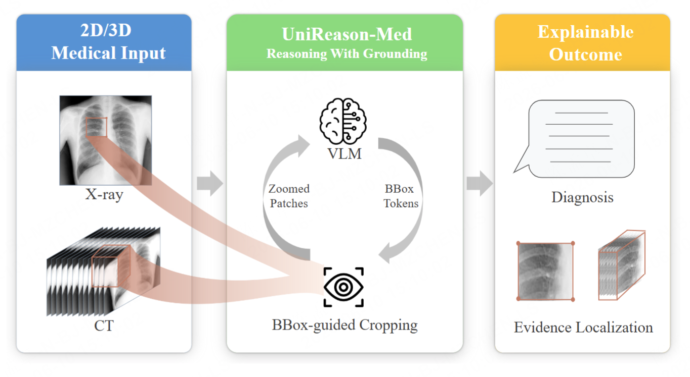
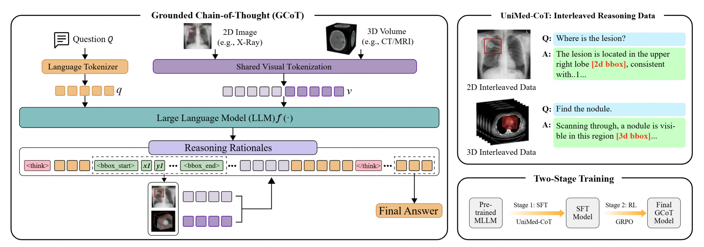
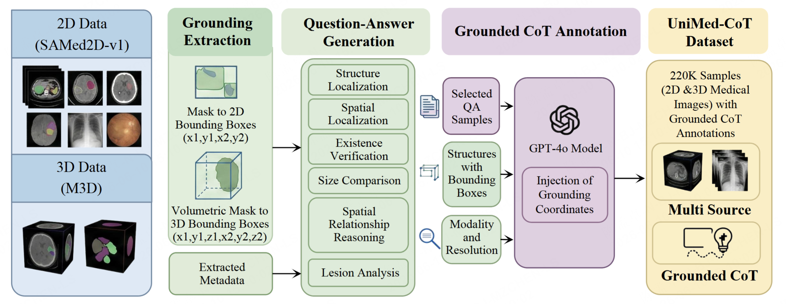
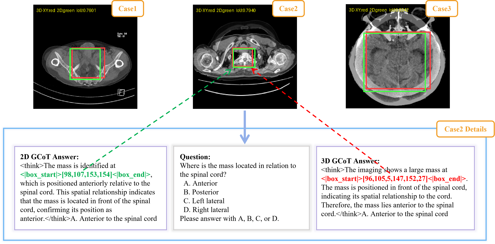

# UniReason-Med

UniReason-Med accompanies the paper **"UniReason-Med: A Shared Grounded Reasoning Interface for 2D-to-3D Transfer in Medical VQA"**.

<p>
  <a href="https://huggingface.co/datasets/IQuestLab/UniReason-Med-Data">
    
  </a>
  <a href="https://huggingface.co/IQuestLab/UniReason-Med">
    
  </a>
</p>

<p align="center">
  
</p>

## Introduction

UniReason-Med studies whether grounded reasoning supervision from abundant 2D medical images can improve 3D medical VQA when both modalities share a common reasoning interface. The framework trains a single checkpoint that can process either a 2D image or a slice-serialized 3D volume, generating interleaved textual reasoning and localized visual evidence through shared box syntax, region-token injection, and a common grounded reasoning policy.

The paper constructs **UniMed-CoT**, a 220K-sample instruction-tuning dataset with interleaved textual reasoning and grounded visual evidence: 170K samples come from 2D medical images and 50K from 3D medical cases. The training recipe uses supervised fine-tuning followed by outcome-level reinforcement learning with GRPO. During RL, the method uses answer and format rewards rather than ground-truth localization-overlap rewards such as IoU or Dice.

A central result is that joint 2D+3D grounded supervision improves 3D reasoning compared with 3D-only training under matched schedules, while the shared grounding interface also benefits 2D tasks.

## Figures

Overview of UniReason-Med. (a) Grounded visual evidence extraction for a 2D image or 32-slice CT
sequence under the shared GCoT interface. (b) Interleaved UniMed-CoT data format. (c) Two-stage SFT+GRPO training.

<p align="center">
  
</p>

UniMed-CoT construction. From SAMed2D-v1 and M3D segmentation masks, we extract grounding
coordinates, generate QA pairs, and use GPT-4o to produce interleaved grounded CoT annotations, yielding 220K
2D/3D samples.

<p align="center">
  
</p>

Slice-volume grounding consistency. The green boxes correspond to slice-wise 2D GCoT predictions,
while the red boxes correspond to the xy projection of 3D GCoT cuboids within the predicted slice range. The top part shows three example cases, and the bottom part presents the detailed analysis of Case 2, including the question and the reasoning outputs of both 2D GCoT and 3D GCoT.

<p align="center">
  
</p>


## Repository Layout

```text
code/sft/   LLaMA-Factory-based SFT code and configs
code/rl/    verl-based GRPO/RL code and configs
code/inference/  standalone 2D/3D Hugging Face inference
data/       Data documentation
assets/     Figures used in this README
```

## Data

The Hugging Face dataset is released in Parquet format with separate `sft`, `rl`, and `images` splits. The 2D image data is included in the `images` split as image bytes with neutral identifiers, and SFT/RL records refer to those images through `image_ids`.

The 3D samples in the public release are text-only. We do not redistribute 3D image data because these samples are derived from M3D, whose underlying image sources include Radiopaedia and may require separate permission. Users who need the 3D images should obtain the necessary authorization from the original data providers, including M3D/Radiopaedia where applicable.

## SFT

Materialize the released HF data into the local format expected by LLaMA-Factory, then launch training:

```bash
cd code/sft
python scripts/materialize_unireason_med_sft.py --output-dir data/unireason_med_sft
llamafactory-cli train examples/train_full/unireason_med_sft.yaml
```

Primary SFT config:

```text
code/sft/examples/train_full/unireason_med_sft.yaml
```

## RL

Materialize the released HF data into the local format expected by verl, then launch GRPO:

```bash
cd code/rl
python examples/data_preprocess/unireason_med_2d3dmix.py --output-dir data/unireason_med_rl
MODEL_PATH=/path/to/sft/checkpoint bash examples/grpo_trainer/run_unireason_med_grpo.sh
```

Primary RL entrypoint and config:

```text
code/rl/examples/grpo_trainer/run_unireason_med_grpo.sh
code/rl/examples/urm_multiturn/config/unireason_med_2d3dmix_grpo_vllm.yaml
code/rl/examples/reward_function/unireason_med_mcq_reward.py
```


## Inference

Standalone Hugging Face inference code for both 2D images and 3D volumes is provided in:

```text
code/inference/unireason_med_infer.py
```

It supports the same grounded reasoning interface used during training: 2D region crops from `<|box_start|>[x1,y1,x2,y2]<|box_end|>` and 3D cuboid crops from `<|box_start|>[x1,y1,z1,x2,y2,z2]<|box_end|>`. See `code/inference/README.md` for single-sample and batch examples.


## Citation

```bibtex
@article{chen2026unireason,
  title={UniReason-Med: A Shared Grounded Reasoning Interface for 2D-to-3D Transfer in Medical VQA},
  author={Chen, Mengzhuo and Shu, Yan and Liu, Chi and Piao, Hongming and Wang, Xidong and Li, Derek and Dai, Bryan},
  journal={arXiv preprint arXiv:2606.11740},
  year={2026}
}
```
